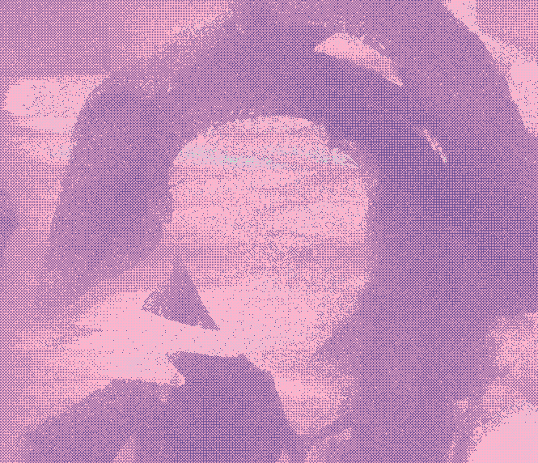
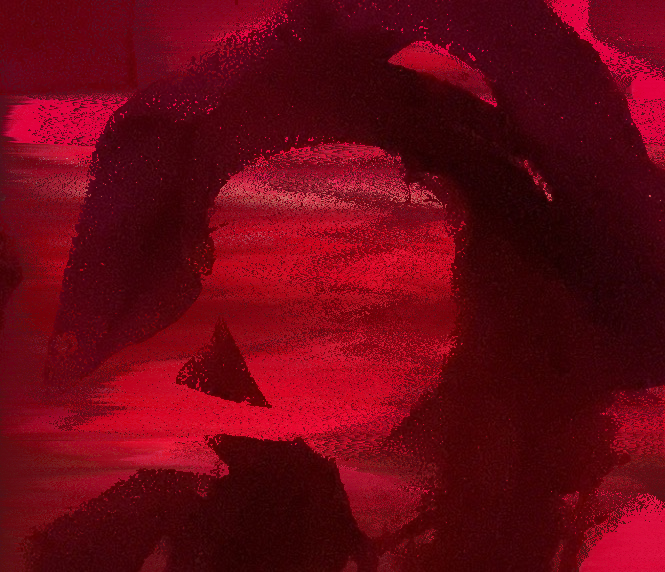

# Python Pixel Sort

This isn't the most efficient way of doing this so if you are looking for a way of implementing this into an app or project look into WebGL shaders since that will likely be the most performant way of achieving an effect like this.

This is meant for creating interesting images for profile photos or distorting images for art pieces. Those are the uses I made it for and have used it for. If you have additional use cases or create anything using this reach out so I can see!

## Running

`python your_path/your_image.jpeg <luminance_threshold int>`
